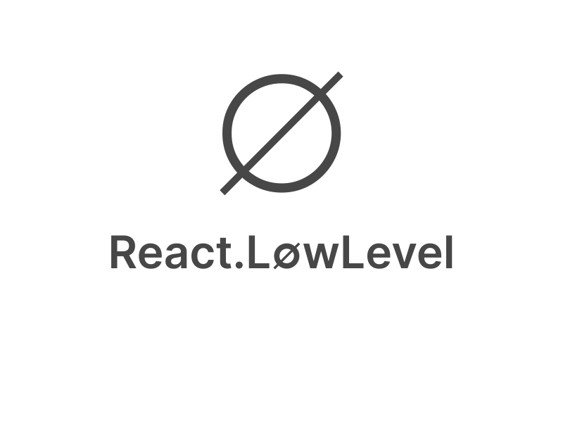

# React.LowLevel

Use React to write beautiful interfaces for low power devices

## Coming soon

This project is yet too young to show anything. Please follow project for more updates which comes soon.

## Description

React.LowLevel is a framework that empowers developers to create impressive user interfaces on low-power and small CPU devices, including platforms like Arduino, ESP32, and similar hardware. With React.LowLevel, it becomes possible to seamlessly connect LCD, TFT, e-ink, and other display types, facilitating the rendering of various UI elements such as gauges, buttons, and tables. This framework excels at enabling the development of multi-panel, multi-page applications with remarkable ease.

What sets React.LowLevel apart from React Native is its unique capability to establish direct communication with the C programming language. This enables developers to embed `C` code directly into React components, facilitating direct control over hardware interactions and offering opportunities for low-level optimizations. This integration with C empowers developers to harness device-specific functionalities and maximize performance on these resource-constrained devices.

Example of component (VIP):

```ts
import { useState } from 'react';
import { TFT, Text, GPIO } from 'react.low-level';
import { Pins } from 'react.low-level/arduino'

const App = () => {
    const [ticks, setTicks] = useState();

    return (<>
        <TFT pins={{
            CS: Pins.D10,
            CD: Pins.D9,
            reset: Pins.D8
        }}>
            <Text>{ticks}</Text>
        </TFT>
        <GPIO mode="button" pin={Pins.D1} onPress={() => setTicks(ticks + 1)}>
    <>);
}
```

(Some nice screenshots would go here...)

## How does it work

React.LowLevel enforces a constrained subset of TypeScript for writing React code, disallowing the usage of types like any or unknown among some other features. This disciplined approach ensures code can be transpiled into C with some extra addons such as closures. The TypeScript code is then analyzed and transpiled into C, allowing it to be consumed with standard C tooling. Notably, React.LowLevel itself, including the event loop and many components, is written directly in C and imports only the necessary modules. This approach significantly reduces the requirements for RAM, ROM, and CPU resources.

However, it's important to note that certain features of React and many TypeScript/JavaScript functionalities are not available in React.LowLevel. For instance, changing prototypes, exceptions (as of now), React.Suspense, and React server-side components are among the features that are not supported.

Further details on the inner workings of React.LowLevel will be provided at a later stage, offering a deeper understanding of its functionality and capabilities.
